# Beyond AUC: A Cost-Sensitive, Calibration-First Evaluation of Card-Not-Present Fraud Models under Temporal Drift

*Code and full experiment container. All numbers below are produced by the committed pipeline and persisted in `results/metrics/`.*

## Abstract
 
Card-not-present fraud is usually detected by models and then graded on how well they rank transactions from most to least suspicious. The production system ( live service that answers each payment request real time) must instead decide to approve or decline and its two errors carry opposite, unequal costs: a missed fraud costs the transaction amount; a false decline costs the margin on a legitimate sale. On the IEEE-CIS dataset, 590,540 real e-commerce transactions, 3.50% fraudulent, provided by the payment company Vesta for a Kaggle competition (2019), we keep the models conventional (regularized logistic regression; LightGBM, a gradient-boosted tree ensemble) and spend the evaluation effort on the decision layer that turns scores into actions, under a strict out-of-time protocol: train on the first four months, make every choice on the fifth, test exactly once on the sixth. Shuffled cross-validation, which mixes past and future rows, overstates next-month PR-AUC (ranking score suited to rare-event data) by 0.30 for LightGBM (0.87 → 0.56) while moving the linear model by 0.017: the optimism measures how much a model memorizes individual cards. With missed-fraud cost A and false-decline cost kA, expected cost is minimized by declining when the fraud probability exceeds k/(1+k), independent of A; on the untouched test month this threshold beats the conventional F1-selected one by +7.9 points of cost savings (paired 95% CI +5.1 to +10.8). The rule acts on probabilities, so the scores must first be calibrated: an isotonic calibrator — a monotone remapping of scores to observed fraud frequencies, fitted on one held-out month — adds +2.2 points (CI −0.2 to +4.3). The system saves 39.4% of the cost of the best model-free policy, approve-everything or decline-everything (CI 35.8–42.8%), catching 67.2% of fraud at a 5% false-positive rate; monthly retraining recovers +7.5 of the savings points a never-retrained model loses.
 
## 1. Introduction
 
In card-not-present (CNP) payments, within e-commerce and remote orders where the physical card is never shown, a fraud model reads each transaction as it arrives and returns a score: the higher, the more fraud-like. The customary evaluation treats that model as a *ranking* device. Data is split by shuffled cross-validation: rows are assigned to K-folds at random, the model trains on K−1 folds and is scored on the one held out, and the folds rotate until every row has been predicted once; an efficient default whose core assumption is that rows are interchangeable. The scores are then summarized by AUC, the area under the ROC curve, which is the probability that a randomly chosen fraud is scored above a randomly chosen legitimate transaction. AUC's appeal in this is that it is threshold-free which averages performance over every possible cutoff, so it can be reported without committing to one.
 
A payment system cannot avoid committing. It has to approve or decline each transaction, and the two errors this creates cost money in opposite directions. A missed fraud is approved, completes, and comes back as a chargeback: the transaction amount is lost. A false decline blocks a legitimate order: the margin on the sale is lost, and with some probability the customer is too. An evaluation that averages over all cutoffs is therefore silent on the two questions that matter operationally — where to place the cutoff, and what a misplaced one costs.
 
Neither error is insignificant. Javelin Strategy & Research estimated falsely declined card transactions at almost **$118 billion per year** in the U.S., with 15% of cardholders experiencing a false decline within a year and 39% of those abandoning the declined card afterward [4]. The problem has not dissipated: in PYMNTS Intelligence's 2026 merchant survey, **85% of merchants** call reducing friction for legitimate customers their biggest fraud-prevention challenge, and nearly half estimate that up to 5% of legitimate orders are incorrectly declined; roughly $50 billion of industry revenue [5]; the 2024 MRC/Visa Acceptance global fraud report finds most merchants self-report false-positive rates of 2–10% of orders [3]. The threat side, meanwhile, keeps industrializing: Visa's Spring 2025 Biannual Threats Report tracks a 22% six-month rise in enumerated transactions and attributes ~US$1.1B of annual follow-on fraud to enumeration alone [7].
 
Balancing these two losses is precisely the objective Visa assigns to its own CNP scoring product: Visa Deep Authorization is described as a deep-learning risk score built to "boost approvals for card-not-present transactions" while detecting and declining fraud [6]. The balance is struck not by the classifier but by the *decision layer*: the threshold that turns a score into approve-or-decline, and the probability scale that threshold is applied to. A model that improves AUC but is thresholded naively, on distorted scores, can lose money relative to a weaker model with an honest decision layer. This decision layer, not the classifier, is the project subject.
 
We make four contributions on the public IEEE-CIS dataset [1]:
 
1. **A cost-sensitive decision layer, evaluated in dollars.** With the cost of a missed fraud set to the transaction amount and the cost of a false decline set to k × amount, expected-cost decisioning declines exactly when the fraud probability exceeds k/(1+k) (Elkan [2]) — a threshold derived in one line (§4.4), independent of amount. We stress it across k ∈ {0.05, …, 1.0} and compare it against F1-optimal, Youden-J, and the trivial policies using the savings convention of Bahnsen et al. [10], with bootstrap confidence intervals, on a strictly out-of-time test month.
2. **A measured optimism gap.** The same models, features, and hyperparameters are evaluated three ways — shuffled 5-fold cross-validation, GroupKFold by month, and the temporal protocol. The difference between the first and the last is the optimism a leaderboard-style evaluation silently adds (§5.1).
3. **Calibration priced in dollars.** Training with class weights distorts the probability scale on purpose; we repair it with Platt/isotonic calibrators fitted only on the validation month [12] and price the repair at the analytic threshold (§5.2–5.3).
4. **Drift made operational.** Weekly out-of-time decay under three retraining cadences (static / expanding / sliding), population-stability indices on the model's top features, and adversarial validation — the quantities a model-risk owner would actually monitor (§5.4).
Everything runs on CPU from the public dataset (`make all`; obtaining the data requires a Kaggle account and acceptance of the competition rules). Every aggregation feature is tested to use only information from strictly earlier transactions — its value at any row is unchanged when all later rows are deleted (§4.3) — and the test month is touched exactly once.

## 2. Related work
 
**Cost-sensitive learning.** Elkan's foundational result is that once the costs of the two errors are written down, the optimal decision on calibrated probabilities is a fixed threshold computed from those costs alone — no search involved [2]. Bahnsen, Aouada & Ottersten carry example-dependent costs into card fraud and introduce the *savings* measure used throughout this paper: the fraction of cost removed relative to the best policy that needs no model at all (approve everything or decline everything, whichever is cheaper) [10]. We keep the models conventional and concentrate the cost-sensitivity in the decision layer, where it can be audited.
 
**Calibration.** A model's scores are *calibrated* when they can be read as frequencies: among transactions scored 0.20, about one in five should turn out fraudulent. Platt scaling fits a two-parameter S-curve from scores to probabilities on a held-out sample [12a]; isotonic regression fits a monotone step function — more flexible, needing more data but no shape assumption (Zadrozny & Elkan [12b]). Guo et al. document that modern learners are systematically miscalibrated and that such simple post-hoc maps largely repair them [12c]. Fraud adds two twists: class-weighted training (used here) shifts the score scale by design, and drift erodes calibration over time — which is why we track Brier score and expected calibration error weekly, out-of-time (§5.2, §5.4).
 
**IEEE-CIS top solutions.** The competition's winning entry (Deotte & Yakovlev) reconstructed a client identifier from `card1`, `addr1`, and `D1`, aggregated behavior over it, and validated with GroupKFold on months as non-overlapping groups — because client-level memorization otherwise masquerades as generalization [8]. We read that solution as precedent and as warning: the mechanics that win a leaderboard are the same mechanics that leak under a shuffled split. Our aggregates are restricted to expanding, past-only statistics (§4.3), and no aggregate uses the fraud label at all — in production, chargeback labels arrive weeks late.
 
**Drift and operating points.** The Bank Account Fraud benchmark (Jesus et al., NeurIPS 2022) standardizes evaluation of dynamic, imbalanced tabular data at a fixed operating point: "we select the threshold in order to obtain 5% false positive rate (FPR), and measure the true positive rate (TPR) at that point" [11]. Fixing the false-positive rate mirrors how fraud teams operate — a decline-and-review budget is set first, and models compete on the fraud caught within it. We adopt TPR@5%FPR as the headline ranking metric and add the dollar-denominated decision layer on top.

## 3. Data
 
The IEEE-CIS Fraud Detection corpus (Vesta Corporation, 2019) contains **590,540** e-commerce transactions spanning **182 days**, of which **20,663 (3.499%)** are labeled fraudulent [1]. Each row carries the transaction amount, a product code, card and address fields, a distance field, and purchaser/recipient email domains, plus four blocks of features supplied with the data: counting features `C1–C14` (frequency counters whose exact definitions are withheld; the documented example is how many addresses are associated with the card); time deltas `D1–D15` (such as days since a previous transaction); binary match flags `M1–M9` (whether details on the card agree with details on the order); and `V1–V339`, features Vesta engineered in-house — rankings, counts, and other entity relations, anonymized. A second table, joined on `TransactionID`, adds 41 columns of device and network identity (device type and model, operating system, browser, and anonymized `id_` fields) for the **24.4%** of transactions that have it.
 
Time is provided as `TransactionDT`, a second-offset from an undisclosed reference date — the data reveal order and spacing, never the calendar. We define `day = TransactionDT // 86400`, `week = day // 7`, and `month = min(day // 30, 5)`, merging the 2–3 day tail stub into the final month (DECISIONS D-003). Relative time is all a chronological protocol requires.
 
Two properties of the stream shape everything downstream. First, it is **non-stationary**: the monthly fraud rate moves from 2.48% (month 0) to 4.04% (month 1) and back down to 3.47% (month 5), and transaction volume swings week to week (Figures 1–2). A model fitted once is a snapshot of a moving target. Second, the **label is operational, not oracular**: `isFraud` reflects Vesta's chargeback-linked process — downstream transactions of a flagged account or card can inherit the label, and reporting delay censors the newest data. Together these argue for chronological evaluation and against any feature that aggregates the label. All modeling uses the labeled training file only; Kaggle's unlabeled test set appears nowhere in any evaluation claim.
 
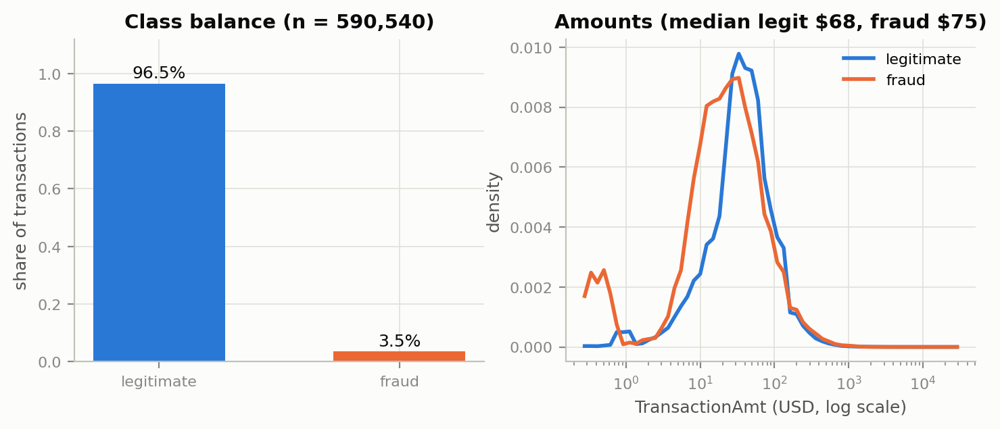
 
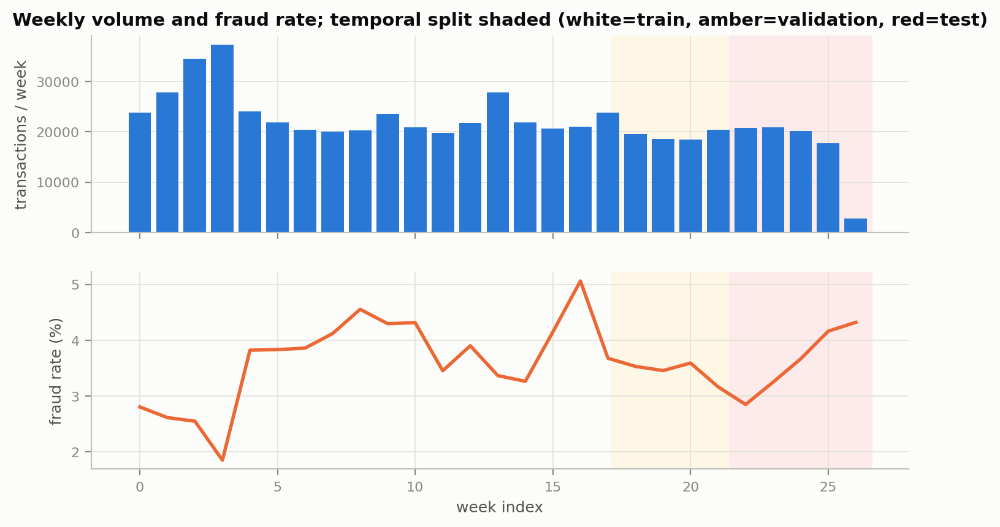


## 4. Methodology

### 4.1 Temporal protocol

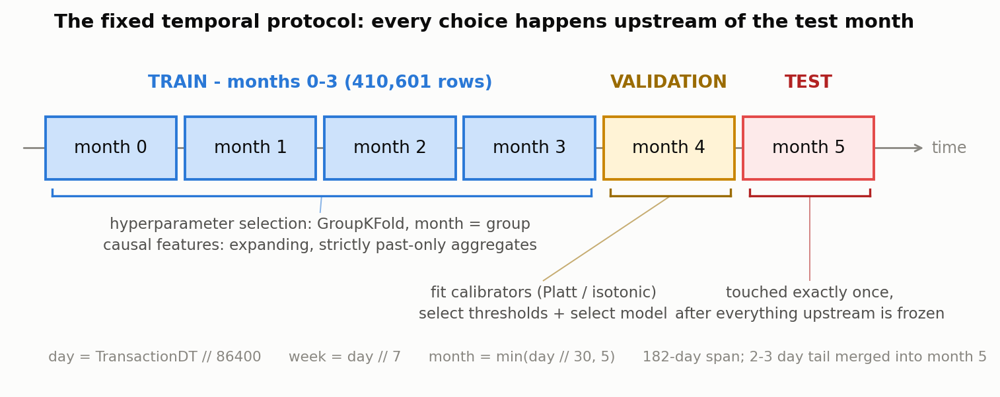

The six months are given three non-overlapping roles. **Months 0–3 are training** (410,601 rows) — the only data any model's parameters ever see. **Month 4 is validation** (85,303 rows) — every choice that requires held-out data is made here, once: calibrators are fitted, thresholds selected, and the final model chosen. **Month 5 is test** (94,636 rows) — evaluated exactly once, after everything upstream is frozen, so the reported numbers cannot have been tuned toward it even accidentally. Hyperparameters are selected inside the training window with GroupKFold using month as the group: each tuning fold holds out one whole month, so a candidate configuration is always scored on a month it never trained on — a small-scale rehearsal of the real task, which is predicting a month you have not seen. Weekly curves use `week = day // 7`. Automated tests assert the protocol mechanically: no temporal overlap between splits, and disjoint fold groups (`make test`).

### 4.2 Models and imbalance

We evaluate two models, named by their production roles: the **champion** is the incumbent a new model must beat to justify replacing it; the **challenger** is the model attempting to. Here the champion is L2-regularized logistic regression on the interpretable feature blocks (core, counts, time deltas, match flags, numeric identity). Its preprocessing is fitted strictly on the training window: median imputation and scaling statistics, missingness-indicator columns for the D block (whose time deltas are frequently absent), and one-hot encodings restricted to the 30 most frequent training-window values of each categorical. The challenger is LightGBM — a gradient-boosted tree ensemble — on all blocks, with its native categorical handling. The champion sets the floor a black-box must clear to be worth its opacity.

Class imbalance (3.5% positives) is handled by weighting, not resampling: `scale_pos_weight` is set to the negative-to-positive ratio of whatever window is being fitted, so the rare class contributes commensurately to the loss. We do not use SMOTE or any synthetic oversampling, for a reason that runs through this whole paper: resampling manufactures a training distribution that does not exist, distorting the probability scale the decision layer depends on, and it interacts badly with post-hoc calibration. Weighting plus explicit recalibration achieves the same operating-point control while keeping the probability semantics auditable (DECISIONS D-004/D-005).

Hyperparameter search is deliberately modest: Optuna's TPE sampler, 12 trials inside a 45-minute budget, scored on the GroupKFold-by-month folds (best fold PR-AUC 0.626). This project's rigor is spent on evaluation, not tuning depth.

### 4.3 Causal features

"Causal" here is a time-ordering property, not a causal-inference claim: a feature is causal when its value at any row is computable from strictly earlier rows alone. Beyond row-local transforms (log of the amount, the cents pattern of the amount, hour of day, day of week), we add expanding, past-only aggregates over two entity keys — the card identifier `card1`, and the pair `(card1, addr1)`: the entity's prior transaction count, seconds since its previous transaction, its past mean amount, and the ratio of the current amount to that past mean. These are behavioral-consistency signals: they ask whether this transaction resembles this card's own history.

The defining property is enforced by test, not convention. `tests/test_causal_features.py` recomputes every aggregate on truncated prefixes of the data and requires the value at row *i* to be identical when every later row is deleted. A feature that fails is using the future.

No aggregate uses the label. In production, fraud labels are chargebacks and arrive weeks late; a feature like "this card's past fraud rate" silently assumes labels appear instantly — temporal leakage of the operational kind (§3). None is used here.

### 4.4 Cost framework

Each transaction carries an amount A and receives a fraud probability p. The two errors are priced as in §1: approving a fraud costs A (a write-off proxy); declining a legitimate order costs kA, where k expresses the harm of a false decline as a fraction of the sale it blocks (k = 0.15 prices a wrongly blocked $100 order at $15). The expected cost of approving is p·A; of declining, (1−p)·k·A. Declining is the cheaper action exactly when

**p·A > (1−p)·k·A  ⟺  p > k/(1+k)**,

and A has cancelled: one threshold serves every transaction size (Elkan [2]). The central case k = 0.15 gives threshold 0.1304; a sensitivity grid k ∈ {0.05, 0.15, 0.30, 0.60, 1.0} spans the regimes from "false declines are cheap" to "a false decline is as bad as the fraud" (§5.3). The inequality is a statement about a probability, so it is actionable only on calibrated scores — which is why §5.2 precedes it in the results.

Dollar performance is scored by the savings convention (§2): `savings = 1 − Cost_model / Cost_baseline`, with `Cost_baseline = min(cost(approve-all), cost(decline-all))`. A model no better than the best do-nothing policy scores 0; eliminating all cost scores 1; negative values mean the model made things worse.

Six policies are compared on identical test data: the two trivial policies; the F1-optimal threshold (the cutoff maximizing the harmonic mean of precision and recall — a statistical default that implicitly prices the two errors equally); Youden's J (the cutoff maximizing TPR − FPR, another cost-blind convention); and the analytic threshold k/(1+k) applied to uncalibrated and to calibrated probabilities. The F1 and Youden cutoffs are themselves selected on the calibrated month-4 scores, so the comparison in §5.3 isolates the thresholding rule, not the score quality. All thresholds are frozen before test. Calibrators — Platt and isotonic (§2) — are fitted on month 4 only; whichever has the lower validation Brier score (the mean squared error between predicted probabilities and outcomes; lower is better) is frozen for test.

### 4.5 Drift and ablation design

**Drift.** Weekly performance is traced across months 4–5 under three retraining cadences: **static** (train once on months 0–3, never update), **expanding** (retrain at each month boundary on all data so far), and **sliding** (retrain monthly on the trailing three months). One rule keeps them comparable: every training window holds out its own final 14 days to fit its calibrator (D-006), so no cadence gets a fresher calibrator than the others. Input drift is measured two ways. The population stability index (PSI) compares a feature's distribution in each evaluation week against its distribution in the training window — one number per feature per week, computed for the model's top-20 features by gain (LightGBM's measure of how much a feature contributes to its splits). Adversarial validation trains a separate classifier to distinguish training-window rows from out-of-time rows: AUC ≈ 0.5 means the two are indistinguishable, and the further above 0.5, the more the inputs have genuinely shifted. We run it both with and without the cumulative aggregates of §4.3, because entity counters grow mechanically over time and would let that classifier win for an uninteresting reason.

**Ablation.** Stage 6 measures what each feature block is worth. With hyperparameters and tree count held fixed — so differences measure features, not tuning luck — the challenger is retrained under forward addition (block A alone, then A+B, and so on through A+…+F, where A is the core fields plus the causal aggregates and F is the identity table; §5.5 tabulates the lettering) and under leave-one-block-out. Each configuration is scored on validation by the change in TPR@5%FPR and in savings; the selected configuration is confirmed exactly once on test (§5.5). → A+…+F) and leave-one-block-out configurations, scoring ΔTPR@5%FPR and Δsavings on validation; the selected configuration is confirmed once on test.

## 5. Results

*This section reports the persisted outputs in `results/metrics/`; every figure is generated by `make figures` from those artifacts.*

### 5.1 The optimism gap

Identical features and tuned hyperparameters, three split regimes:

| LightGBM | ROC-AUC | PR-AUC | TPR@5%FPR |
|---|---|---|---|
| random 5-fold CV (mean) | 0.968 | 0.866 | 0.891 |
| GroupKFold by month (mean) | 0.917 | 0.618 | 0.700 |
| out-of-time test (month 5) | 0.904 | 0.564 | 0.672 |
| **gap: random − test** | **+0.064** | **+0.302** | **+0.219** |

The logistic champion's corresponding gaps are +0.020 / +0.017 / +0.035. Two observations matter. First, the shuffled estimate is not mildly optimistic — it reports a model roughly *30 PR-AUC points* better than the one that exists next month, and the distortion is largest exactly where fraud metrics live (the high-precision region; ROC-AUC hides it). Second, the gap is model-dependent: the boosted model, which can memorize card-profile behavior across a shuffled split, inflates; the linear model, which cannot, does not. Grouped-by-month CV lands within 3–5 points of the true out-of-time numbers and is the honest offline surrogate. **Takeaway (Figure 3): the choice of split changes the reported number more than any modeling choice in this paper.**

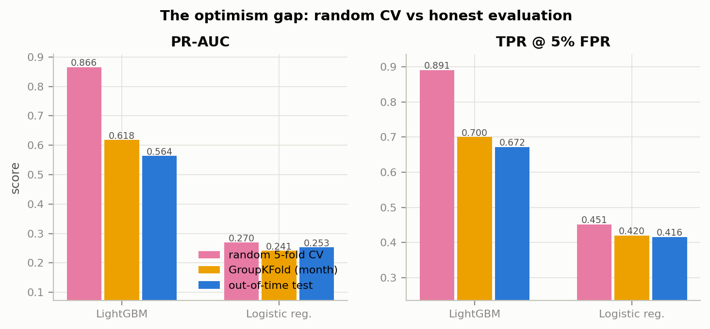

### 5.2 Calibration

Class-weighted training (`scale_pos_weight` ≈ 27) leaves the raw scores usable for ranking but distorted as probabilities (Platt slope 0.67 on validation: raw log-odds are overconfident). Isotonic regression, fit on month 4 only, wins on validation Brier (0.01802 vs 0.01820 Platt vs 0.01866 raw) and transfers to the untouched test month: Brier 0.0217 → 0.0212, log-loss 0.1053 → 0.0884, ECE 0.0146 → 0.0041. Weekly out-of-time tracking shows the calibrated scores hold their reliability across both evaluation months. **Takeaway (Figure 4): a one-month held-out calibrator repairs the probability scale that the decision layer is about to lean on — cheaply and stably.**

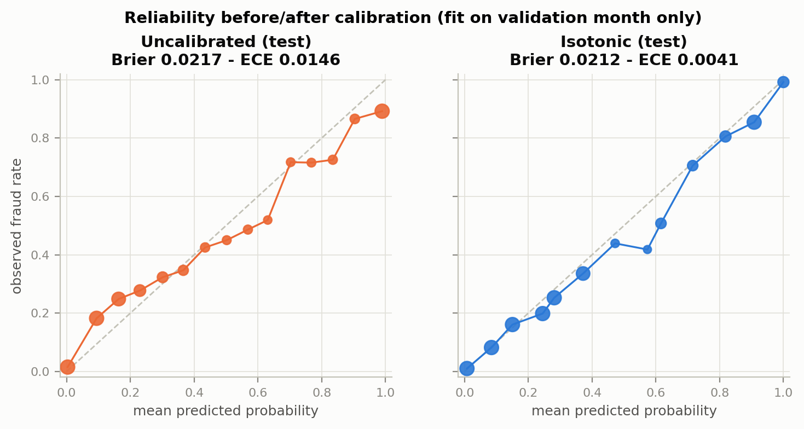

### 5.3 The decision layer in dollars

Test month: 94,636 transactions, 3.47% fraud; baseline policy is approve-all (cost $495,244). All thresholds frozen on validation.

| policy | total cost | savings | fraud $ caught | legit $ declined | TPR | FPR |
|---|---|---|---|---|---|---|
| approve all | $495,244 | 0.0% | $0 | $0 | 0.000 | 0.000 |
| decline all | $1,872,497 | −278.1% | $495,244 | $12,483,317 | 1.000 | 1.000 |
| F1-optimal | $339,675 | 31.4% | $171,157 | $103,921 | 0.439 | 0.007 |
| Youden J | $359,583 | 27.4% | $367,605 | $1,546,285 | 0.748 | 0.089 |
| cost thr., uncalibrated | $311,403 | 37.1% | $221,430 | $250,591 | 0.521 | 0.015 |
| **cost thr., calibrated** | **$300,271** | **39.4%** [35.8, 42.8] | $274,003 | $526,866 | 0.604 | 0.029 |

The ordering is the argument. Youden J catches the most fraud dollars but burns $1.55M of legitimate volume to do it; F1 is precise but timid; the analytic threshold k/(1+k) beats both — **+7.9 points of savings over F1** (paired 95% CI [+5.1, +10.8], positive in 100% of resamples). Calibrating before thresholding adds +2.2 points / $11.1K on the month (2.25% of baseline); the paired CI [−0.2, +4.3] just crosses zero, so on a single test month this increment is directionally consistent (96% of resamples) rather than individually significant — we report it as such. Across the k grid (Figure 6), the analytic policy adapts and stays positive everywhere (58.6% savings at k = 0.05, 19.3% at k = 1.0), while the fixed Youden threshold collapses to **−238%** at k = 1.0: a threshold chosen without reference to costs does not merely underperform, it changes sign. **Takeaway (Figure 5): where you cut matters more than how well you rank — and the right cut is a formula, not a grid search, once probabilities are calibrated.**

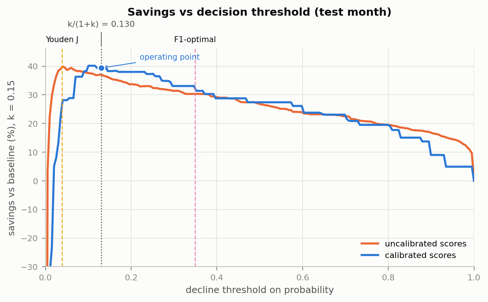

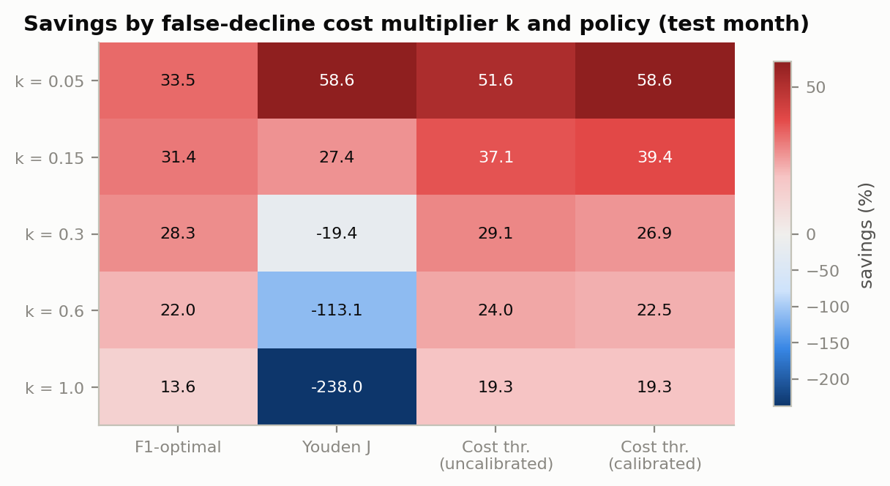

### 5.4 Drift and retraining cadence

Weekly performance decays visibly within the two out-of-time months, with a trough at week 20 and only partial recovery. Retraining at the month boundary changes the picture (month-5 means, uniform holdout-calibration protocol):

| cadence | TPR@5%FPR | PR-AUC | savings (k=0.15) |
|---|---|---|---|
| static (train once) | 0.651 | 0.535 | 0.354 |
| expanding (all past) | **0.703** | **0.600** | **0.429** |
| sliding (last 3 months) | 0.696 | 0.597 | 0.422 |

One monthly retrain recovers **+7.5 points of savings** over the static model; keeping all history edges out the 3-month window, so recency matters less than freshness. On the input side, PSI flags concentrated, interpretable drift: `id_31` (browser version) reaches PSI 1.36 — software-ecosystem churn, invisible to a static model — and the cumulative entity counters drift mechanically (0.37); 3 of the top-20 features breach the conventional 0.2 alarm by the final week. Adversarial validation separates train from out-of-time rows with AUC 0.964 — and still 0.899 after removing the mechanically-trending aggregate features, so the shift is genuine covariate drift, not an artifact of the counters. **Takeaway (Figures 7–8): this dataset retires "train once, deploy forever" on its own — and the decision-relevant decay (savings) is steeper than the rank-metric decay.**

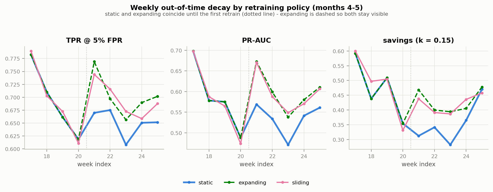

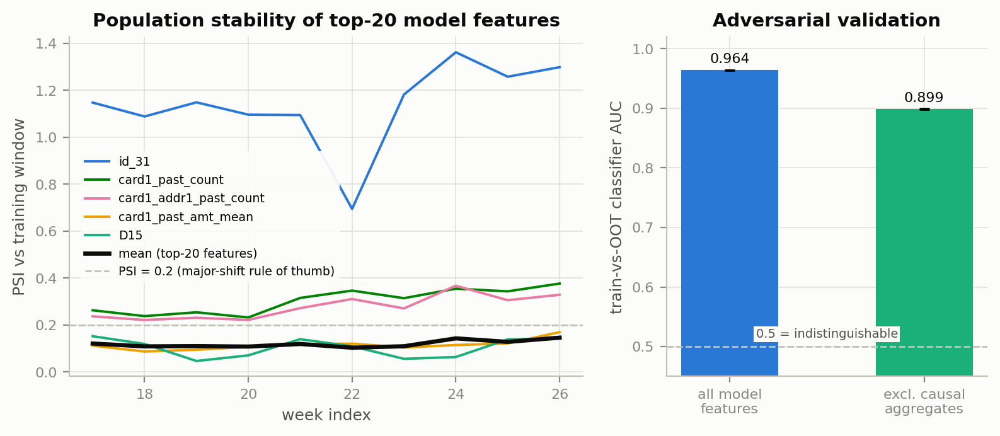

### 5.5 Incremental validity of the feature blocks

Forward addition on validation (fixed hyperparameters and tree count):

| configuration | TPR@5%FPR | savings |
|---|---|---|
| A core (+ causal aggregates) | 0.439 | 0.262 |
| + B counts (C1–C14) | 0.616 | 0.405 |
| + C time deltas (D1–D15) | 0.656 | 0.432 |
| + D match flags (M1–M9) | 0.666 | 0.449 |
| + E Vesta (V1–V339) | 0.676 | 0.473 |
| + F identity | 0.685 | 0.470 |

Core + counts — 40 interpretable features — deliver **86% of the full configuration's savings**. The 339 anonymized Vesta features buy +2.4 points of savings; the identity table buys +0.9 points of TPR while costing −0.3 points of savings at this operating point. Leave-one-block-out confirms no block strictly harms both criteria (removing counts costs −4.9 points of savings; removing match flags is cost-neutral), so the full configuration is retained for the headline model. **Takeaway (Figure 9): most of the black-box's dollar value lives in a small auditable core — a governance-relevant fact when every extra block is attack surface, latency, and model-risk documentation.**

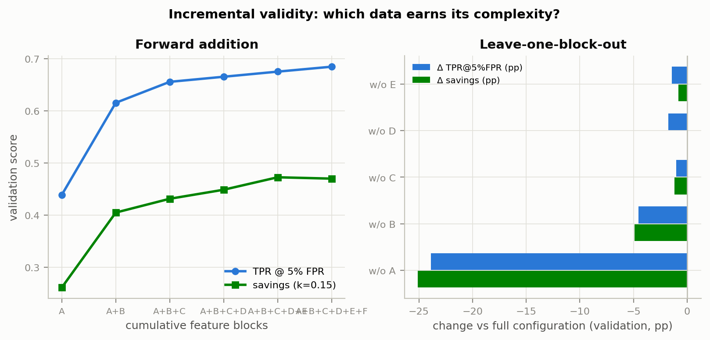

### 5.6 Explainability

TreeSHAP on a stratified 20K-row test sample puts velocity and identity-consistency signals at the top: `C13` and `C1` (Vesta count features), purchaser email domain, and — notably — three of the causal aggregates built here (`card1_past_amt_mean`, `card1_addr1_past_count`, `card1_past_count`) rank inside the top eleven. The paired waterfalls show the decision anatomy a dispute analyst needs: the true positive is declined on a first-seen card profile transacting at an unusual amount; the false positive is a legitimate customer who *looks* first-seen — exactly the failure mode that step-up authentication, rather than a hard decline, should absorb. **Takeaway (Figure 10): the model's dollars come from behavioral-consistency features, which is also where its false declines come from.**

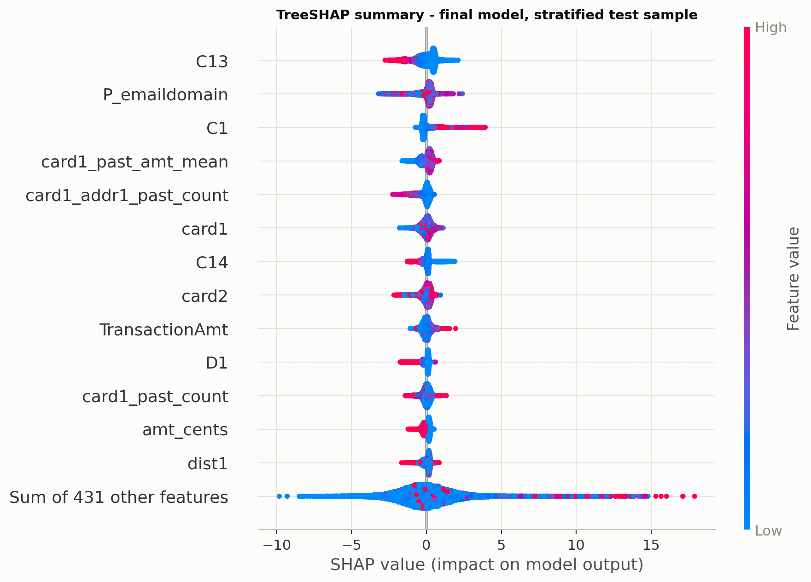

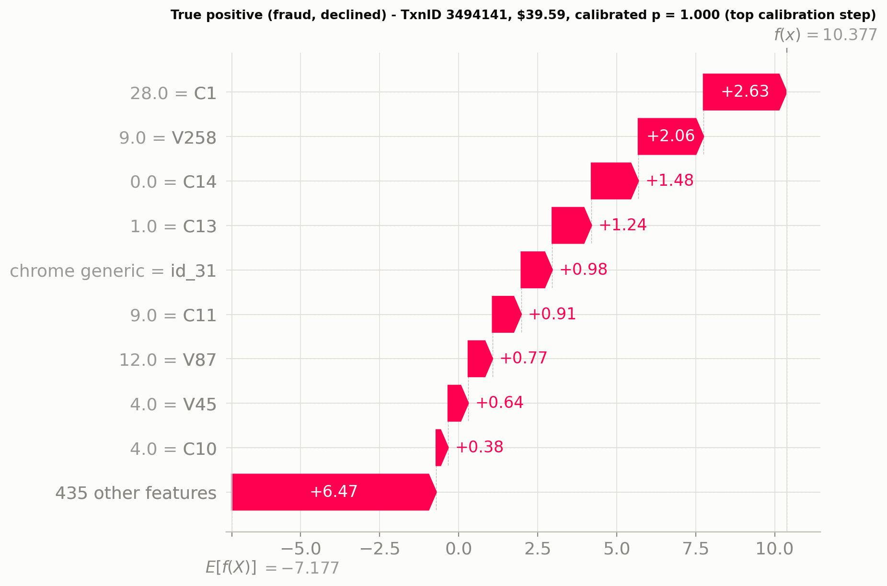
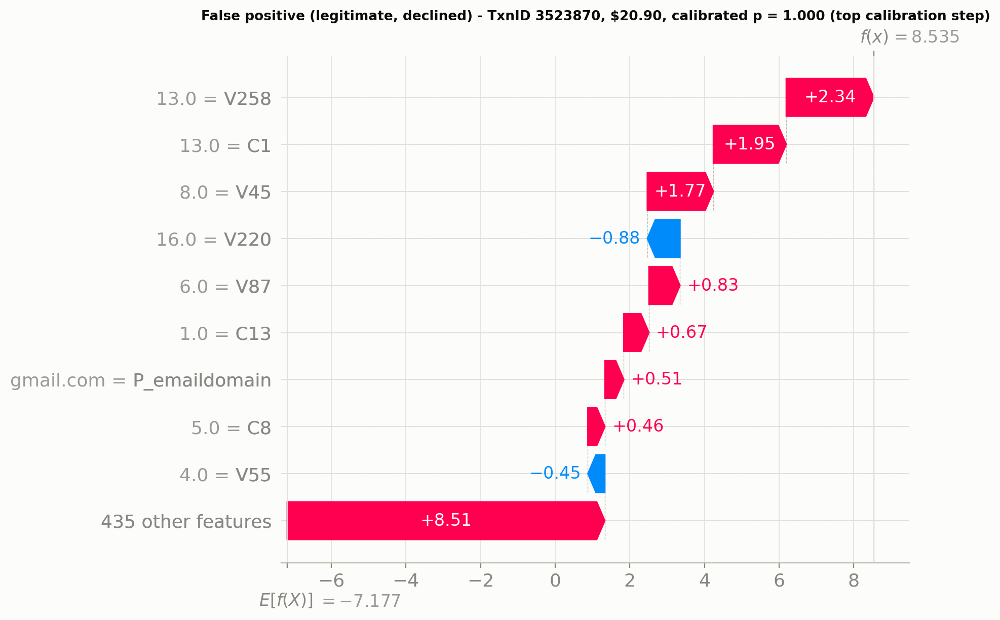

## 6. Discussion

**Limitations.** This is one anonymized 2019 e-commerce dataset; the drift studied is historical, not adversarially live. The label is chargeback-linked and inherits reporting noise, delay, and within-account propagation — our "ground truth" is itself an operational artifact. The cost model is a two-parameter proxy: real FN costs include interchange, disputes, and recovery; real FP costs are heterogeneous across customers and partially recoverable through step-up authentication rather than hard declines; k is best read as a governance dial, which is why we report the full sensitivity grid rather than defend a single value. Calibrators and thresholds share the validation month; with more months one would separate those roles.

**What changes at Visa scale.** An issuer-side CNP score runs at authorization time under a roughly millisecond latency budget, which constrains feature stores to streaming, incrementally-updatable state (our expanding aggregates are the batch shadow of that design). Decisions feed back into the data: declined transactions never earn labels, creating selective label censoring that offline benchmarks cannot exhibit. Adversaries adapt to the deployed boundary — enumeration attacks alone shifted 22% in six months [7] — so the drift measured here is a lower bound on the operational problem. And at network scale, calibration is not a nicety but the contract: issuers consume scores as probabilities when setting strategy thresholds.

**A monitoring plan this analysis directly supports.** (1) Weekly TPR@5%FPR and savings on a rolling labeled window, alarmed against the decay slopes in Figure 7. (2) Weekly Brier/ECE on the deployed calibrator; recalibrate when the uncalibrated-vs-calibrated dollar gap reopens. (3) PSI on the top-20 features with the conventional 0.2 trigger, plus a quarterly adversarial-validation AUC as an omnibus shift detector. (4) Retraining cadence set by the measured curves — retrain when its projected savings recovery exceeds retraining and review cost, not on a calendar reflex. (5) Champion–challenger with the logistic champion as a sanity floor and threshold changes governed as decisions, not tuning.

## 7. Reproducibility

Python 3.11; pinned versions in `requirements.txt`; seed 42 throughout. Data (Kaggle credentials + accepted competition rules required):

```bash
kaggle competitions download -c ieee-fraud-detection -p data/raw/
# or place ieee-fraud-detection.zip at data/raw/ manually
make data      # checksum, unpack, schema validation report
make features  # causal feature build + EDA artifacts
make train     # tuning + three split regimes + final model + scores
make evaluate  # calibration, cost layer, ablation, drift, single test pass
make figures   # all paper figures from persisted artifacts
make test      # split-integrity, causality, and cost-model tests
make notebooks # generate + execute the six thin notebooks
make app       # streamlit demo from cached artifacts (no Kaggle needed)
```

Raw data is never committed. SHA-256 checksums of the archive and CSVs are recorded in `results/metrics/data_checksums.json`. Wall-clock on the 2-vCPU build machine: `make data`+`features` ≈ 6 min; `make train` ≈ 2 h 03 m (45 m of it the capped tuning budget); `make evaluate` ≈ 2 h 33 m (ablation 55 m, drift 31 m, final test pass 67 m — of which TreeSHAP on 20K rows × 2,190 trees is 65 m); figures + notebooks ≈ 3 m. Total ≈ **4 h 45 m**; on a typical 4–8-core laptop LightGBM's near-linear thread scaling brings this into the 2–3 h range. The Streamlit demo runs entirely from `app/artifacts/` (a cached, stratified 20K-row test sample); deployment notes for Streamlit Community Cloud / Hugging Face Spaces are in `app/README-deploy.md`, including the competition-rules caveat on redistributing data-derived artifacts.

## References

1. IEEE-CIS Fraud Detection (Kaggle competition, Vesta Corporation, 2019). https://www.kaggle.com/competitions/ieee-fraud-detection
2. Elkan, C. (2001). The Foundations of Cost-Sensitive Learning. *IJCAI-01*. https://cseweb.ucsd.edu/~elkan/rescale.pdf
3. Merchant Risk Council, Visa Acceptance Solutions & Verifi (2024). *2024 Global eCommerce Payments & Fraud Report* (25th ed.). https://www.cybersource.com/content/dam/documents/campaign/fraud-report/global-fraud-report-2024.pdf
4. Javelin Strategy & Research (2015). *False-Positive Card Declines Push Consumers to Abandon Issuers and Merchants.* https://javelinstrategy.com/press-release/false-positive-card-declines-push-consumers-abandon-issuers-and-merchants
5. PYMNTS Intelligence (2026). *Orchestrating Trust: The Future of Fraud Prevention in Payments* (merchant survey coverage). https://www.pymnts.com/fraud-prevention/2026/47-percent-of-merchants-report-false-declines-cost-them-sales/ ; https://www.pymnts.com/fraud-prevention/2026/85percent-of-merchants-say-fraud-tools-must-reduce-checkout-friction/
6. Visa (2024). Visa Deep Authorization — Visa Protect. https://www.visa.com/en-us/solutions/secure-card-payments
7. Visa Payment Ecosystem Risk & Control (2025). *Biannual Threats Report, Spring 2025.* https://corporate.visa.com/content/dam/VCOM/corporate/solutions/documents/visa-perc-biannual-report-spring-2025.pdf
8. Deotte, C. & Yakovlev, K. (2019). IEEE-CIS 1st-place solution write-up (FraudSquad). https://www.kaggle.com/competitions/ieee-fraud-detection/writeups/fraudsquad-1st-place-solution-part-2 ; accessible summary: https://developer.nvidia.com/blog/leveraging-machine-learning-to-detect-fraud-tips-to-developing-a-winning-kaggle-solution/
9. *(Anchor dropped after verification — see results/metrics/citation_verification.json.)*
10. Correa Bahnsen, A., Aouada, D. & Ottersten, B. (2015). Example-dependent cost-sensitive decision trees. *Expert Systems with Applications* 42(8), 6609–6619. https://albahnsen.github.io/files/Example-Dependent%20Cost-Sensitive%20Decision%20Trees.pdf
11. Jesus, S., Pombal, J., Alves, D., Cruz, A., Saleiro, P., Ribeiro, R.P., Gama, J. & Bizarro, P. (2022). Turning the Tables: Biased, Imbalanced, Dynamic Tabular Datasets for ML Evaluation. *NeurIPS Datasets & Benchmarks*. https://papers.nips.cc/paper_files/paper/2022/hash/d9696563856bd350e4e7ac5e5812f23c-Abstract-Datasets_and_Benchmarks.html
12. (a) Platt, J. (1999). Probabilistic Outputs for Support Vector Machines… *Advances in Large Margin Classifiers* 10(3), 61–74. https://www.semanticscholar.org/paper/42e5ed832d4310ce4378c44d05570439df28a393 — (b) Zadrozny, B. & Elkan, C. (2002). Transforming classifier scores into accurate multiclass probability estimates. *KDD '02*. https://dl.acm.org/doi/10.1145/775047.775151 — (c) Guo, C., Pleiss, G., Sun, Y. & Weinberger, K.Q. (2017). On Calibration of Modern Neural Networks. *ICML*. https://arxiv.org/abs/1706.04599

*Label caveat, dataset licensing, and the full decision log: `DECISIONS.md`. The dataset is subject to the Kaggle competition rules and is not redistributed by this repository.*
